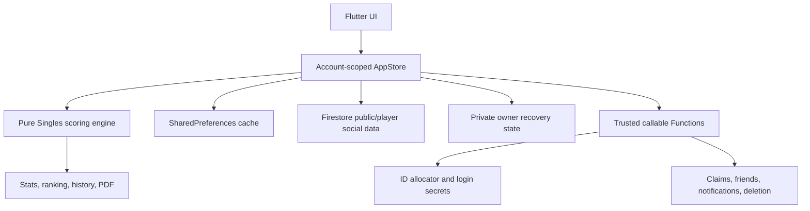
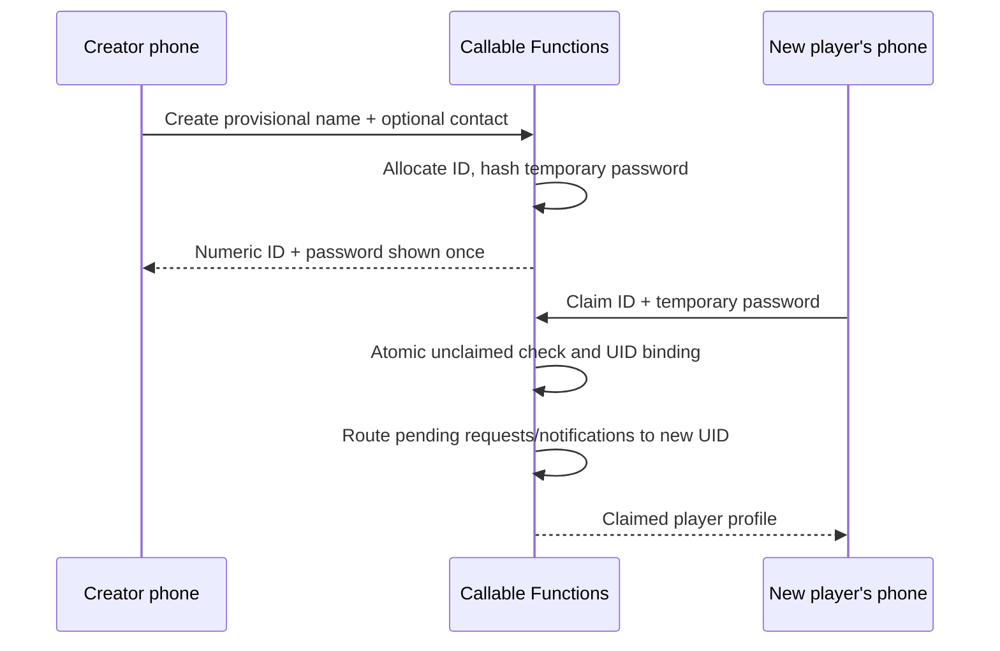

# CricXii architecture

## Runtime shape

The scoring engine has no Firebase dependency. Match results are rebuilt from score events; undo removes the final event and recalculates derived state. Network failure never blocks a match being scored on the ground.

## Identity and player ownership

- Firebase Auth UID is the account boundary.
- `users/{uid}.playerId` maps one authenticated account to one player.
- `players/{playerId}` is the public cricket identity.
- Other players cached locally are opponents/friends; the UI cannot switch into them.
- Sensitive contacts live in separate field documents and in the owner's private recovery snapshot.
- Password hashes are scrypt hashes stored only in backend-denied `loginSecrets` documents.
- Google and Facebook are Firebase Auth providers linked to the same UID; changing a provider does not replace cricket data.

## Numeric ID allocation

Each warm Function instance reserves a block of 1,024 sequential IDs in a Firestore transaction. It then allocates locally from that block and atomically creates `playerIds/{id}`. A crashed instance may leave harmless gaps, but cannot duplicate an ID. Allocation work is constant-time and independent of total player count.

The sequence starts at `100000`; there is no formatting prefix or separator. It naturally reaches 7, 8, 9, and 10 digits without a schema change.

## Main Firestore documents

| Path | Purpose | Writer |
|---|---|---|
| `users/{uid}` | UID → Player ID mapping | Functions only |
| `users/{uid}/private/state` | Owner recovery snapshot | Owner only |
| `players/{playerId}` | Public identity and aggregate stats | Owner / Functions |
| `players/{id}/contactFields/{field}` | One sensitive value + privacy ACL | Owner only |
| `players/{id}/friends/{friendId}` | Privacy-rule friendship edge | Functions only |
| `playerIds/{id}` | Global uniqueness and claim state | Functions only |
| `loginSecrets/{id}` | Scrypt login/claim secret | Functions only |
| `friendRequests/{pair}` | One request state per player pair | Functions only |
| `friendships/{pair}` | Accepted friendship | Functions only |
| `notifications/{id}` | In-app activity for a UID/player | Functions only |

Account reset removes the player's server-side friendships, pending requests, notifications, and aggregate statistics. Account deletion additionally removes the identity, login secret, public profile, private recovery tree, and Firebase Auth user.

## Provisional-player claim

## Privacy evaluation

Every sensitive field independently stores `visibility` and `audienceIds`. Firestore rules use server-created friendship edges and the signed-in player's custom `playerId` claim. Listing all contact fields is denied; the app requests known fields individually, so a denied field remains absent.

## Current match persistence

Singles play remains local-first and is copied into the owner's private recovery state. Cross-phone live match documents are deliberately deferred until revision-checked event writes and creator/tracker authorization are implemented.

## Package identity

- Display name: `CricXii`
- Android application ID: `com.texiol.crixx`
- Flutter package: `crixx`
- Functions region: `asia-south1`
- Product owner: Texiol
