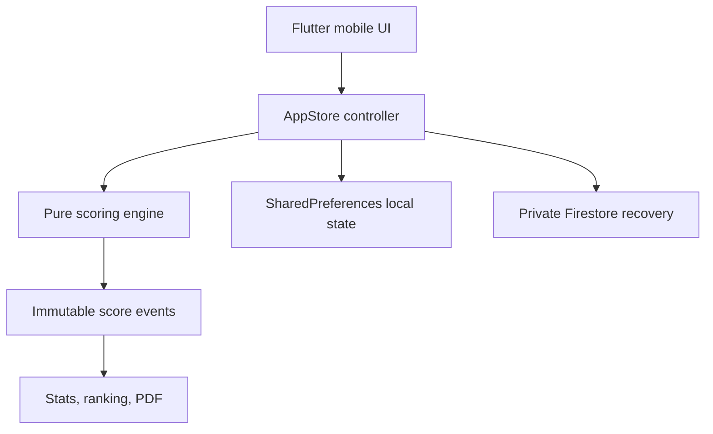
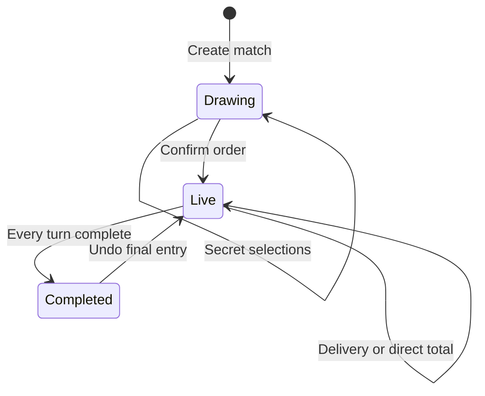

# CricXii architecture

## Runtime shape

The scoring engine has no Flutter or Firebase dependency. Every screen records an event; totals, wickets, fielding credits, points, current batter, and winner are rebuilt from those events. Undo removes the last event and recalculates the same derived state, preventing score and career-stat drift.

## Match lifecycle

For a tracked match, a turn completes on wicket or when legal deliveries reach `ballLimit`. Wides and no-balls can add extras without consuming a legal ball. For direct mode, the one `quickSummary` event completes that player's turn.

## Current persistence

The phone is authoritative during play. The entire small V1 state is serialized locally after every change. When Firebase is enabled and the user is signed in, the same schema is copied into the user's private Firestore document for recovery. A failed network write never blocks scoring.

This snapshot strategy is appropriate for the first Singles build, but not for shared live editing. Connected Singles will normalize these collections:

| Collection | Responsibility | Primary authorization |
|---|---|---|
| `players/{playerId}` | Public cricket identity and aggregate stats | Owner UID |
| `gangs/{gangId}` | Home gang and roles | Leader/Co-leader |
| `matches/{matchId}` | Setup, participants, lifecycle, official metric | Creator/Tracker |
| `matches/{matchId}/events/{eventId}` | Append-only scoring events | Creator/Tracker |
| `claimTickets/{playerId}` | One-time unclaimed-profile transfer | Trusted backend only |

## Multi-phone conflict plan

Connected match writes will carry an incrementing revision. The creator or selected tracker submits the next event in a Firestore transaction only when the stored revision matches. Other devices subscribe read-only to the event stream. Secret-draw selection also uses a transaction so two players cannot take the same card.

## Package and ownership

- Product display name: `CricXii`
- Android application ID: `com.texiol.crixx`
- Flutter package name: `crixx`
- Product owner: Texiol
